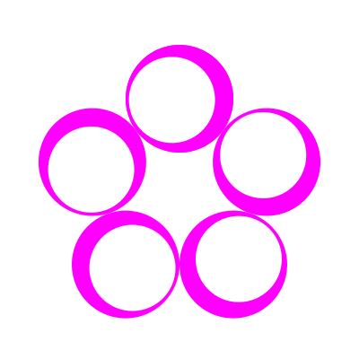

# joy.js



joy.js is a tiny creative coding library that makes it easy to create 2D shapes, combine them, and apply both simple and more complex transformations.

It started as a [p5.js](https://p5js.org/) port of the original [joy](https://github.com/fossunited/joy) library, which was written in Python.

Over time, I’ve expanded the library by decoupling the rendering engine from its core functionality. This means you can now create multiple renderers, each with its own way of handling shapes and transformations, while still using the same concise and powerful API.


## Examples

### Basic shapes

```js
c = joy.circle()
```


```js
c = joy.circle({x: 50, y: 50, r: 50})
```


```js
s1 = joy.circle()
s2 = joy.ellipse()
s3 = joy.rectangle()
s4 = joy.line()
```


### Combining shapes

```js
function donut(x, y, r) {
    let c1 = joy.circle({x: x, y: y, r: r})
    let c2 = joy.circle({x: x, y: y, r: r/2})
    return c1.add(c2)
}   
d = donut(0, 0, 100)
```


### Transformations

```js
shape = joy.circle({r: 50})
        .translate({x: 100, y: 0})
```


```js
const SQRT2 = 1.414
let r1 = joy.rectangle({w: 200, h: 200})
let r2 = r1.clone().rotate({angle: 45}).scale({x: 1/SQRT2, y: 1/SQRT2})  // clone call becomes necessary
```


### Higher order transformations

```js
c = joy.circle({x: -100, y: 0, r: 50})
shape = c.repeat({n: 10, transform: joy.translate({x: 10, y: 0})})
```


```js
shape = joy.line().repeat({n: 18, transform: joy.rotate({angle: 10})})
```


```js
shape = joy.rectangle({w: 200, h: 200}).repeat({n: 18, transform: joy.rotate({angle: 10})})
```


```js
shape = joy.rectangle({w: 300, h: 300}).repeat({n: 72, transform: joy.rotate({angle: 360/72}).scale({x: 0.92, y: 0.92})})
```


```js
c = joy.circle({x: 100, y: 0, r: 50})
shape = c.repeat({n: 36*4, transform: joy.rotate({angle: 10}).scale({x: 0.97, y: 0.97})})   // rotate happens opposite
```


